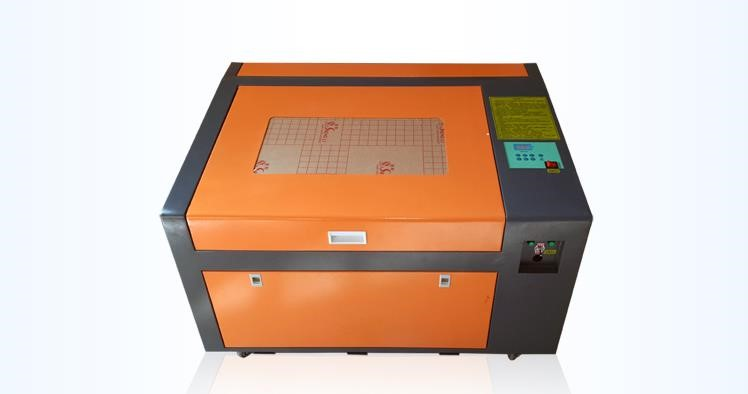
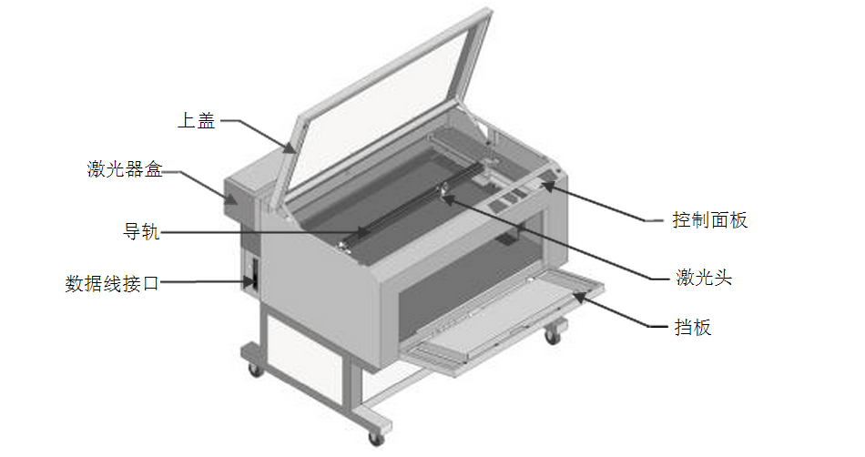
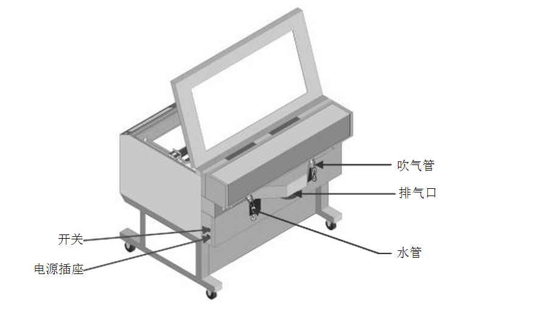

***

<!-- more -->

### 适用材料
有机玻璃、亚克力、PVC材料、橡胶、塑料、木制品、皮革等**非金属材料**

### 功率选择
激光管分三个功率，功率越低切割厚度越薄，40w配置适用雕刻，不适合切割，50w功率配置适用于雕刻和切割，切割厚度一般为0-4mm。60w切割厚度为0-10mm，使用者应根据实际情况选择合适的激光功率。可以通过调节控制面板上的功率输出百分比来调节功率。最大切割速度为100mm/s。

### 基本操作流程 
* 第一步：**安装激光器，接通冷却水和除尘通风系统**

接通水泵、气泵，打开排风扇或空气净化器，并检查冷却水循环是否正常。 注意：严禁在冷却水循环不正常的情况下使用机器，以免损坏激光器。

* 第二步：**连接电源线、打印线和地线**

连接好雕刻机上的电源线、打印线和地线后，才可以打开雕刻机和计算机的电源开关。

 

* 第三步：**调节光路** 

激光雕刻机属精密光学仪器，对光路调节要求较高，如果激光不是从每个镜片的中心射入，就会影响雕刻效果，建议用户每次工作前务必检查一下光路是否正常。注意：**调节光路的工作，操作员必须经过专业培训后方可进行**。 

* 第四步：**安装打印驱动、USB加密狗驱动**

* 第五步：**图文编辑** 

将事先准备好的图纸导入

* 第六步：**加工定位** 

排版完成后，先要定出加工位置才能放上加工材料。加工定位方法如下：取出待加工材料，先在工作台上贴上一张纸，在排版已完成的基础上点击ACE软件中的“定位框”图标，这时雕刻机在白纸上划上定位框（注意：此时应用小电流，具体操作方法见ACE软件使用说明书）。
 
* 第七步：**确定加工参数**

加工参数包括间隔，速度和电流等。加工间隔是指加工点阵位图时，是逐行逐列的输出还是有间隔的输出，这个加工参数只有雕刻和扫描中才有；加工速度是指横梁和小车的移动速度；加工电流是指激光器的电流。加工方式的不同或是材料、雕刻、切割深度的不同，所用的加工参数不同。在加工前需要根据材料的性质和加工要求来设置加工参数，通常需要实验来设定。当激光器使用时间较长后，输出功率会有所衰减，请适当加大输出电流。

* 第八步：**放置加工材料，定焦距** 

在白纸上的定位框中放上加工材料，调节小车上升降台的高度，使加工表面到抽气罩下表面的距离为8mm，此时待加工表面位于聚集镜的焦点平面上。 

* 第九步：**输出数据加工** 

放好加工材料后，在计算机中生成数据并输出数据，这样雕刻机就开始加工了

* 第十步：**加工完成** 

加工完成后，会有声音提示。在加工过程中，若是冷却水循环不正常，加工会自动停止，直到冷却水循环正常后加工才继续进行。
 
**加工完成后，请务必清洁工作台，保持雕刻机的清洁！**

### 以上操作流程仅供参考，在第一次使用活动室激光雕刻机前，请联系我们以接受相关培训。

